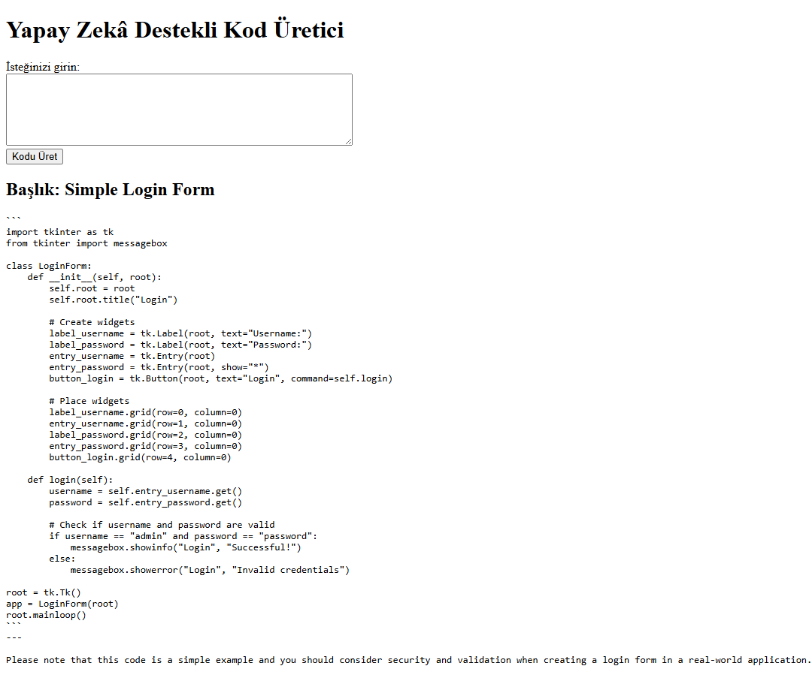

Bu proje, Flask ile geliştirilmiş ve Ollama LLaMA3 modeliyle entegre edilmiş bir yapay zekâ destekli Python kod üretici uygulamasıdır.

Projenin Özellikleri:
- Kullanıcıdan aldığı promat'a göre Python kodu üretir.
- Üretilen kodu özetleyen kısa ve anlamı bir başlık ile sunar.
- Basit ve sade arayüz.

Kullanılan Teknolojiler:
- Python 3.10 
- Flask 
- Ollama (LLaMA 3 Modeli)
- HTML/CSS!

Kurulum:
```
git clone https://github.com/BeyzaCelik0/aiKodUretici.git
cd aiKodUretici
pip install -r requirements.txt
ollama run llama3
python app.py
```

Kullanım:
- Uygulamayı başlatmak için `python app.py` komutunu çalıştırın.
- Tarayıcınızda `http://127.0.0.1:5000` adresine gidin.
- Bir prompt girin ve "Kodu Üret" butonuna basın.
- Yapay zeka, verilen prompt'a göre Python kodunu ve başlığını üretecektir.

Uygulama Arayüzü


Promt Örneği
Prompt: Login formu oluşturan Python kodu
Başlık: Simple Login Form
Kod: 
```
import tkinter as tk
from tkinter import messagebox

class LoginForm:
    def __init__(self, root):
        self.root = root
        self.root.title("Login")

        # Create widgets
        label_username = tk.Label(root, text="Username:")
        label_password = tk.Label(root, text="Password:")
        entry_username = tk.Entry(root)
        entry_password = tk.Entry(root, show="*")
        button_login = tk.Button(root, text="Login", command=self.login)

        # Place widgets
        label_username.grid(row=0, column=0)
        entry_username.grid(row=1, column=0)
        label_password.grid(row=2, column=0)
        entry_password.grid(row=3, column=0)
        button_login.grid(row=4, column=0)

    def login(self):
        username = self.entry_username.get()
        password = self.entry_password.get()

        # Check if username and password are valid
        if username == "admin" and password == "password":
            messagebox.showinfo("Login", "Successful!")
        else:
            messagebox.showerror("Login", "Invalid credentials")

root = tk.Tk()
app = LoginForm(root)
root.mainloop()
```